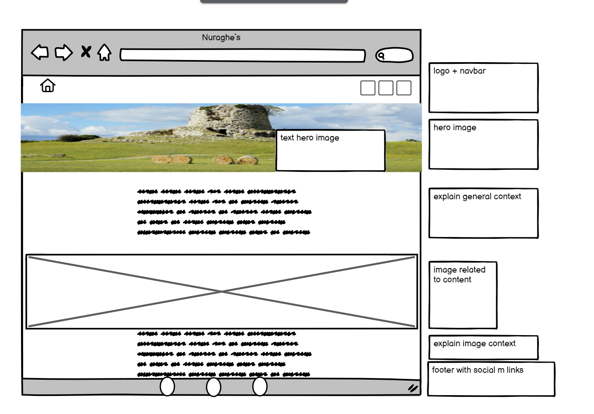
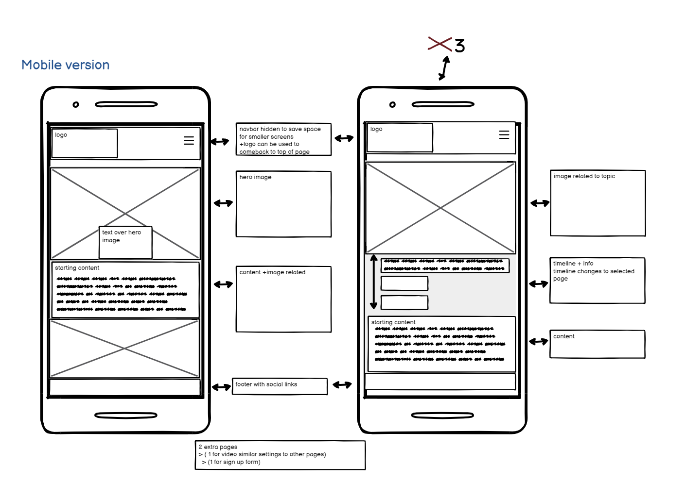

# [Nuraghe's]

Welcome to [Nuraghe's]! This repository hosts the source code and content for my historical website. Here, we aim to provide a rich and immersive experience for exploring and learning about the ancient structure of Sardinia well known as Nuraghe

## Getting Started
**Explore the Code:** Familiarize yourself with the structure of the codebase. The main files and directories you'll be working with include:
- `index.html`: The main HTML file that serves as the entry point to the website.

mettere immagine

- `assets`: Directory containing CSS stylesheets,and medias like images and video. Contains 3 folders favicon/images/video

- `losa.html`: Directory containing content about a specific argument.

- `nuraxi.html`: Directory containing content about a specific argument.

mettere immagine

- `sarbana.html`: Directory containing content about a specific argument.

mettere immagine

- `signup.html`: Directory for Form signup section

mettere immagine

- `README.md`: This README file for guidance and a walktrough.

## Features

### 1. Favicon
   - favicon created from [favicon.io](https://favicon.io/favicon-generator/)
   - View details about each nuraghe, including location, history, and architectural features.

### 2. Virtual Tours
   - Experience virtual tours of nuraghes, allowing users to navigate through these ancient structures from the comfort of their own homes with images and video.

### 3. Educational Resources
   - Access range of educational resources, including article, UNESCO link, and content, to learn more about the history and significance of nuraghes.
   - Engage with multimedia content such as video, images, and interactive timelines to enhance learning.

### 4. Accessibility Features
   - Ensure accessibility for all users, including those with disabilities, by providing alternative text descriptions for images and implementing keyboard navigation features.

## User Stories

- **history enthusiast**, I want to explore the origins and significance of nuraghes, so that I can deepen my understanding of ancient Sardinian civilization and its architectural marvels.

- **student of archaeology**, I want access to scholarly articles and research papers on nuraghes, so that I can study their construction techniques, cultural significance, and historical context for my academic pursuits.

- **traveler planning a trip to Sardinia**, I want to learn about the different nuraghes scattered across the island, so that I can include visits to these ancient sites in my itinerary and immerse myself in the rich history of Sardinia.

- **curious visitor to the website**, I want to explore virtual tours of nuraghes, so that I can experience these ancient structures firsthand and appreciate their unique architectural design!

- **local resident of Sardinia**, I want to contribute my own knowledge and experiences of nuraghes to the website, so that I can share insights and stories passed down through generations within my community and preserve our cultural heritage.

- **visually impaired user**, I want the website to provide accessible content and alternative text descriptions for images of nuraghes, so that I can engage with the information and learn about these ancient structures through screen readers or other assistive technologies.

## Here a Practical way to explain what my idea was at the beginning

- `screenshots` : used balsamic to help myself to get an initial idea and how to approach the development

**Report Issues:** If you encounter any bugs, issues, or have suggestions for improvements, please open an issue on our GitHub repository. Be sure to provide detailed information about the problem or suggestion.

[Nuraghe`s] is designed to be user-friendly and intuitive. Simply navigate to the website URL to start exploring. Here are some key features and functionalities:

- **Palette:** I used a gradient of greys all over the pages, from white to black but mainly grey. Even a dull gray give the feeling to stay in contact with these ancient rocks.
- **structure:** The site starting from the index to finish with the signup page find a simple structure from top to bottom ,very linear with loads of content for the mobile version.
In the desktop I focused more on the media where you can find immersive pictures, a more enlarged structure for the other pages to get a better look on details, without loosing the overall original structure from the index page.

## Contact me

If you have any questions, feedback, or inquiries, please contact us at [valerius92@live.it].

